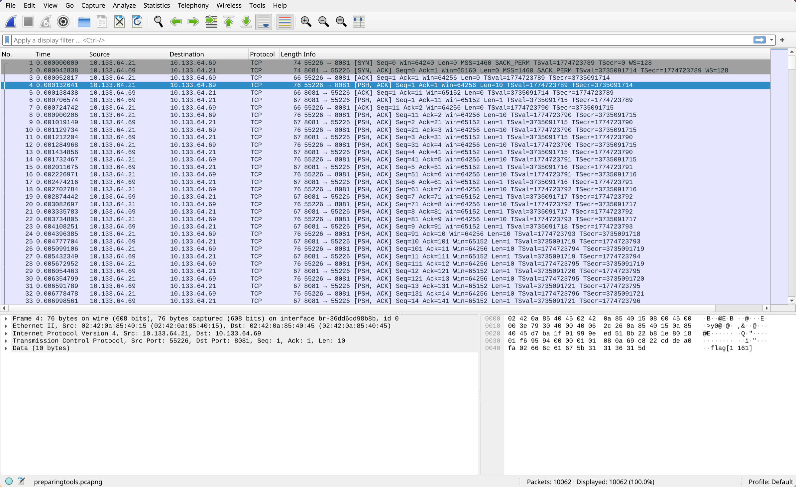

# prepare the tools Writeup by Deffreus - NCW CTF 2024

###### Author: k3ng

## Description


## Files

```
$ file preparingtools.pcapng 
preparingtools.pcapng: pcapng capture file - version 1.0
```

## Solution

Open the file in Wireshark!



We can see the packets are sent in what seems like a pair fashion: a packet with data length of 10 and then 1.
The data on the packet with length of 10 is `flag[XXXX]` where `XXXX` is a number.
The following one byte packet is assumed to be the char of `flag` at index `XXXX`.
For example, `flag[1161] = a`.


We can extract all of these with `tshark -r preparingtools.pcapng -Y 'data.len >= 1' -T fields -e data.data >datas`.
I then reformatted it with Helix's search and replace: `%s^..$<return>kJghhhc3d<esc>Ai0a<esc>,`.
Then, I used CyberChef to decode `datas` from hex:


I then copy-pasted the output into the file `text` and then ran `$ sort text >sort`.
There are a lot of newline feed at the beginning of the file,
but other than that we can see it's forming a comprehensible sentece:


I then did `%s^flag<return>ghv10ldJld`:


There's the flag!
It's just missing the `C` in `CJ{}`, 
but not a big problem!

FLAG: `CJ{warm_up_for_your_scapy/pyshark/tshark}`
