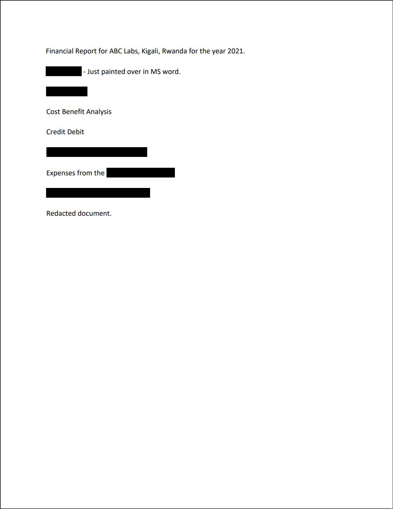

# Redaction gone wrong Writeup by Deffreus - PicoCTF 2022

###### Author: Mubarak Mikail

## Description

Now you DON’T see me.<br>
This [report](https://artifacts.picoctf.net/c/84/Financial_Report_for_ABC_Labs.pdf) has some critical data in it, some of which have been redacted correctly, while some were not. Can you find an important key that was not redacted properly?

<details><summary>Hint 1</summary>
	How can you be sure of the redaction?
</details>

## Files

```
$ file Financial_Report_for_ABC_Labs.pdf 
Financial_Report_for_ABC_Labs.pdf: PDF document, version 1.7, 1 pages
```

## Solution

I open the file in my browser,
Brave!



I noticed that my cursor would change when hovering the redacted box,
I then tried to drag and select it...
It works?

I just did CTRL+A and copy it here:

```
Financial Report for ABC Labs, Kigali, Rwanda for the year 2021.
Breakdown - Just painted over in MS word.

Cost Benefit Analysis
Credit Debit
This is not the flag, keep looking
Expenses from the
picoCTF{C4n_Y0u_S33_m3_fully}
Redacted document.
```

Yup!
Easy!

FLAG: `picoCTF{C4n_Y0u_S33_m3_fully}`
