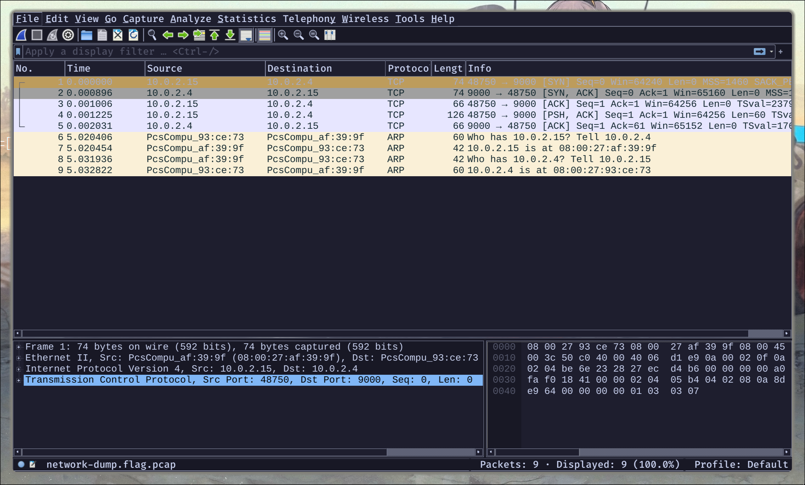

# Packet Primer Writeup by Deffreus - PicoCTF 2022

###### Author: LT 'syreal' Jones

## Description

Download the packet capture file and use packet analysis software to find the flag.

- [Download packet capture](https://artifacts.picoctf.net/c/195/network-dump.flag.pcap)

<details><summary>Hint 1</summary>
	Wireshark, if you can install and use it, is probably the most beginner friendly packet analysis software product.
</details>

## Files

```
$ file network-dump.flag.pcap 
network-dump.flag.pcap: pcap capture file, microsecond ts (little-endian) - version 2.4 (Ethernet, capture length 262144)
```

## Solution

Let's just open it in Wireshark!

OMG it's so small >_<



Aight, I just looked at the packet data view (right bottom),
and at packet number 4, the flag just sits there...

FLAG: `picoCTF{p4ck37_5h4rk_b9d53765}`
